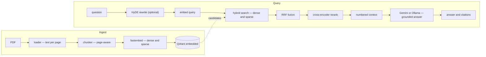
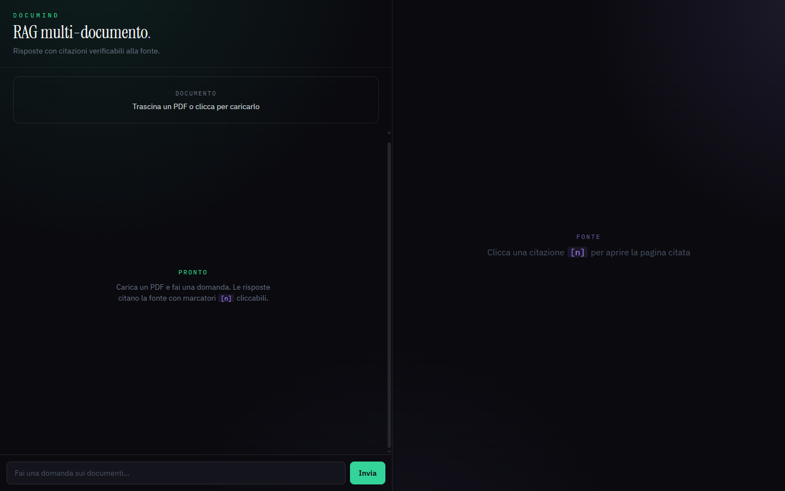
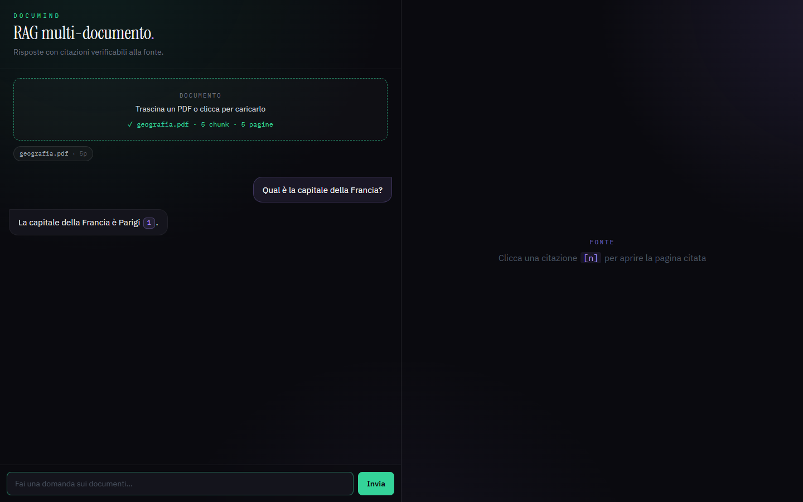

# DocuMind — RAG Multi-Document Intelligence

[](https://github.com/LRimes90/documind/actions/workflows/ci.yml)

Ask questions over your PDFs and get answers grounded in the source, with **real
page-level citations**. DocuMind is not another "chat-with-PDF" wrapper: retrieval
uses **hybrid search** (dense + sparse fused with Reciprocal Rank Fusion) followed by
**cross-encoder reranking**, and its quality is **measured** by a reproducible
evaluation harness — not asserted.

> **Cross-lingual by design:** the embedding and reranking models are multilingual,
> so you can ask a question in English about an Italian document (or vice versa) and
> still get the right passage.

![DocuMind — a streamed answer with a clickable [1] citation opening the cited PDF page, with the source snippet highlighted](docs/screenshots/documind-03-source.png)

---

## Why this is different

Most RAG demos stop at "embed chunks, take top-k, prompt an LLM". DocuMind implements
the three things that separate a toy from a real retrieval system:

1. **Hybrid retrieval + RRF** — dense (semantic) and sparse (BM25 keyword) searches are
   fused *by rank*, not by raw score. Cosine and BM25 live on incompatible scales;
   summing them is a subtle, common bug. RRF avoids it.
2. **Cross-encoder reranking** — the top candidates are re-scored against the question
   by a reranker, which reliably promotes the correct source to position #1.
3. **Reproducible IR evaluation** — `Hit@k`, `MRR`, `Recall@k` over labelled data,
   comparing each retrieval stage. Most repos use soft LLM-as-judge scores; DocuMind
   reports classic IR metrics you can reproduce with one command.

## Evaluation results

Retrieval quality on the bundled synthetic corpus (20 labelled questions, 2
cross-lingual). Reproduce with `uv run python -m eval.evaluate`:

| Config | Hit@1 | Hit@5 | MRR | Recall@5 |
|--------|-------|-------|-----|----------|
| naive (dense only) | 90% | 100% | 0.938 | 100% |
| hybrid (dense + sparse + RRF) | 95% | 100% | 0.967 | 100% |
| **hybrid + rerank** | **100%** | 100% | **1.000** | 100% |

On this small corpus `Hit@5` saturates, but `Hit@1`/`MRR` show the real story: each
stage ranks the correct source higher, and reranking puts it **first every time**.

## Architecture



- **Backend:** FastAPI, Qdrant (embedded — no server, no Docker), fastembed (ONNX, no
  torch), Gemini for generation (Ollama optional for fully-offline use).
- **Isolation:** each module has one job (`ingest/`, `store`, `retrieval/`,
  `generation/`) and is unit-tested in isolation.
- **Frontend:** a React + TypeScript SPA (Vite, TailwindCSS, react-pdf) with a
  streaming chat and clickable `[n]` citations that open the cited PDF page with the
  source snippet highlighted — see [Frontend](#frontend).

## Quickstart

Requirements: [uv](https://docs.astral.sh/uv/) (manages Python 3.12 automatically).

```bash
cd backend
uv sync                              # creates the venv, installs deps
cp .env.example .env                 # then paste your GEMINI_API_KEY
uv run uvicorn app.main:app --reload
```

> **First run** downloads the multilingual ONNX models (dense ~470 MB + reranker),
> cached afterwards. Get a free key at https://aistudio.google.com/apikey.

Ingest a document and ask a question:

```bash
# index a PDF
curl -F "file=@sample_docs/geografia.pdf" http://localhost:8000/documents

# ask (streamed answer + citations via Server-Sent Events)
curl -N -X POST http://localhost:8000/query \
  -H "Content-Type: application/json" \
  -d '{"question": "Qual è la capitale della Francia?"}'
```

## Frontend

A React + TypeScript single-page app (**Vite · TailwindCSS · react-pdf**) providing a
streaming chat with verifiable citations. Answers stream token-by-token over SSE, and
each `[n]` marker is a button that opens the cited PDF page in a side viewer with the
source snippet highlighted — the PDF is rendered **client-side**, so the page you read
is exactly the page that was cited.

```bash
# 1. start the backend (port 8000) — see Quickstart
cd backend && uv run uvicorn app.main:app

# 2. in another terminal, start the frontend (port 5173)
cd frontend
npm install
npm run dev            # open http://localhost:5173
```

The dev server proxies `/api → http://localhost:8000`, so there is no CORS setup in
dev. Build for production with `npm run build`; run the logic/component tests with
`npm run test` (Vitest + Testing Library — pure SSE/citation parsers are TDD-covered).

| Upload & ask | Streamed answer with citation |
|---|---|
|  |  |

## Offline mode (no API key)

DocuMind runs fully offline by swapping the generation provider to a local model via
[Ollama](https://ollama.com):

```bash
ollama pull llama3.1
# in .env:
LLM_PROVIDER=ollama
OLLAMA_MODEL=llama3.1
```

Everything else (embeddings, retrieval, reranking) is already local via fastembed.

✅ Verified offline on macOS with Ollama (`llama3.1` and `qwen2.5:7b-instruct`):
pytest 28/28 · retrieval eval identical to cloud (Hit@1 100%, MRR 1.0 with rerank) ·
grounding 20/20 out-of-corpus questions refused (zero hallucinations) ·
stress 100/100 structural and 100/100 live.

Extended campaign: **10,400 scenario executions, 99.91% pass** across 5 local models
(llama3.1, qwen2.5:7b-instruct, gemma3:4b, llama3.2:3b, phi4-mini) + 8,900-execution
structural soak (0 failures). All 9 misses are grounding lapses of the 3–4B models
(94–98% vs 100% for 7B+) — retrieval, ingest, concurrency and API behavior were
flawless on every model.

## Testing

```bash
uv run pytest                 # full suite (downloads models once)
uv run pytest -m "not slow"   # fast suite (pure logic, no downloads) — this is what CI runs
```

The `slow` marker separates model-dependent tests from pure-logic ones so CI stays fast.

## Evaluation & sample corpus

The corpus under `sample_docs/` is synthetic and reproducible — regenerate it with
`uv run python sample_docs/generate.py`. The gold set lives in `eval/dataset.py`.
Numbers are honestly measured on this corpus; swap in your own PDFs to evaluate on
your data.

## Roadmap

- Multi-format ingestion (DOCX / PPTX / XLSX)
- Observability: tracing + per-query cost/latency dashboard
- Vision / late-interaction retrieval (ColPali-style) for pages with tables & charts
- Agentic self-reflection ("is the answer supported? if not, re-search")

## Tech stack

`FastAPI` · `Qdrant` (embedded) · `fastembed` (multilingual-MiniLM + BM25 +
jina-reranker-v2) · `Gemini` / `Ollama` · `uv` · `pytest` · `React` · `TypeScript` ·
`Vite` · `TailwindCSS` · `react-pdf` · `Vitest`
